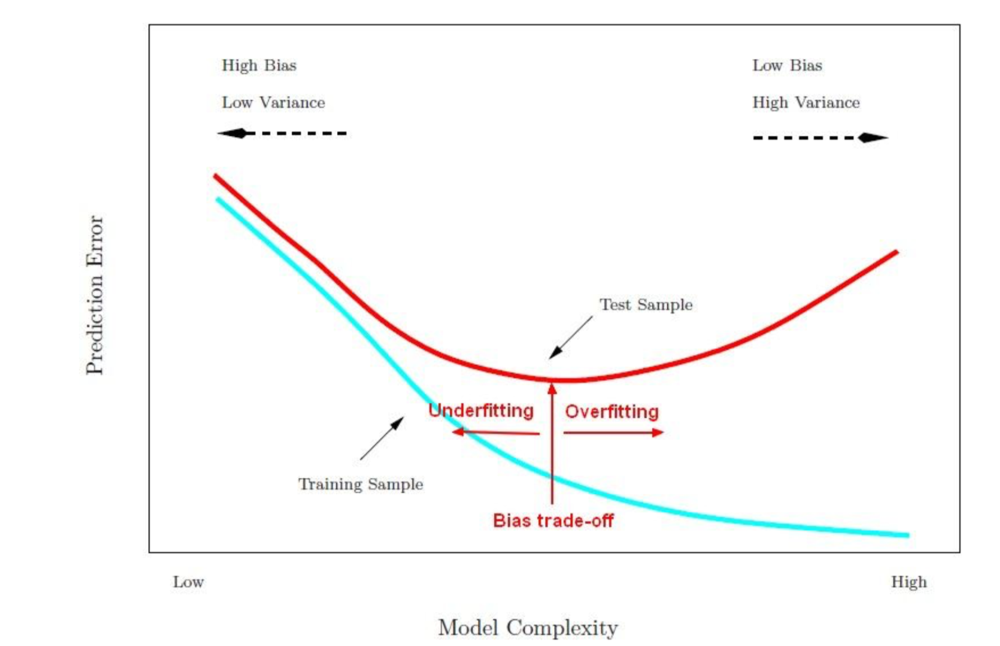

# Cross Validation and Bias Variance Trade-Off

**[Validation Curves](https://scipy-lectures.org/packages/scikit-learn/auto_examples/plot_bias_variance.html)**

- Bias Variance is a fundamnetal topic for understanding model performance. For a more indepth understanding, you can review chapter 2 of **[Introduction to Statistical Learning](https://blog.princehonest.com/stat-learning/)**.

## Simple Model vs Complex Model

- In a nutshell, bias variance trade-off is the process of adding just noise to increase model complexity and flexibility.
- In the process the training errors goes down and the test error increases leading to overfitting. 

## Evaluating Model Complexity
- In order to evaluate the complexity of a model, what you have to do is plot out the complexity or flexibility of the model. 
- For instance the polynomial level of a regression fit versus the error metrices such as the Mean Square Error added with the test and training dataset.

- You want to find the point that balance out the bais and the variance **Known as the Bias Trade-Off Point**

**Our goal is to achieve a low variance and low bias model**
- Low Bias/Low Variance will predict the model correctly on the bulls eyes
- Low Bias/High Variance will predict the model around the bulls eyes with high degree of variance
- High Bias/Low Variance will have high bias to a certain location but low variance
- High Bias/High Variance simple means prediction all over the place basically

**Avoid the temptation to add more complexity to models that would result to overfitting**. This can result to a large error arising from overfitting when tested on a new data.

## Bias Variance Model 
- In the model below we have Low vs High Model Complexity on the **x-axis** and the Prediction Error on the **y-axis**.
- As you move to the left, you get a High Bias and Low Variance 
- As you move to the right, you get a Low Bias and High Variance

