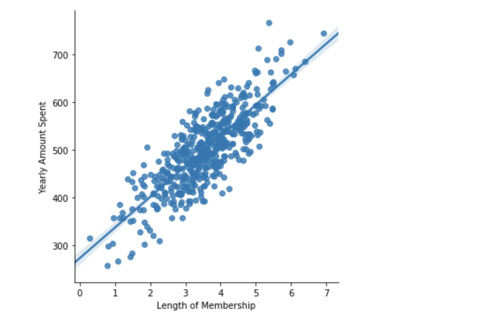
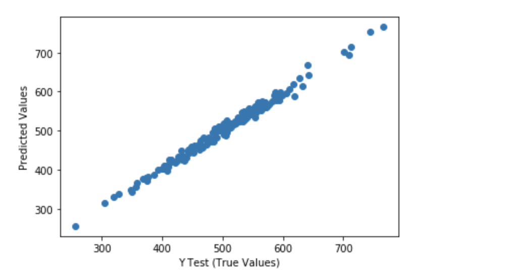
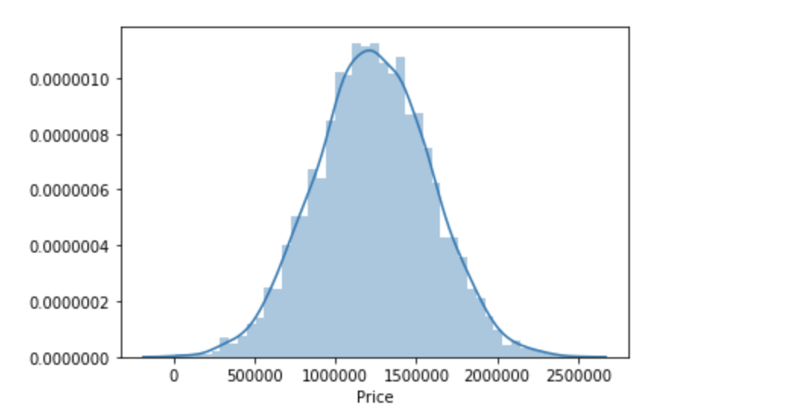

# DataScience_MachineLearning_Portfolio
 This Portfolio contains different Data Science and Machine Learning Projects.

## Machine Learning Process
This section documents the detial processes involved in machine learning and traing a machine learning model.

 - [machine_learning_process](./ml_foundamentals.md)

## Machine Learning Package

**Scikit-Learn package** is the most popular machine learning package for python and has a lot of built-in algorithms.
- Every algorithm in scikit-learn is exposed via an estimator and you will need to install it using either:

- `pip install scikit-learn`
- or
- `conda install scikit-learn`

### Scikit-learn Estimator Object:

**Estimators*** allows you fit models
 - model.fit():fit training data
 - For supervised learning applications, this accepts two argumnents: the data X and the labels y (e.g. model.fit(x,y)).
 - For unsupervised learning applications, this accepts only a single argument, the data x (e.g. model.fit(x)).
 - Because unsupervised learning works with unlabeled data.
**Available in Supervised estimators**
 - model.predict(): given a trained model, predict the label of a new set of data. This method accepts one argument, the new data x_new (e.g. model.predict(x_new)), and returns the learned label for each object in the array.
 - Also available in **supervised estimators**
 - model.predict_proba(): for classification problems, some estimators also provide this method, which returns the probability that a new observation has each categorical label. In this case, the label with the highest probability is returned by model.predict().
 - model.score(): for classification or regression problems, most estimators implements a score method. Scores are between 0 and 1, with a larger score indicating a better fit.
**Available in unsupervised estimators***
 - model.predict(): predict labels in clustering algorithms.
 - model.transform(): given an unsupervised model, transform new data into the new basis. This accepts one argument x_new, and rteurns the new representation of the data based on the unsupervised learning.
 - model.fit_transform(): some estimators implement this method, which more efficiently performs a fit and a transform the same input data.
 

### Result Examples

- linear regression model 

- predicted model using linear regression trained model
 

- Normally Distributed Predicted Model Results
 

