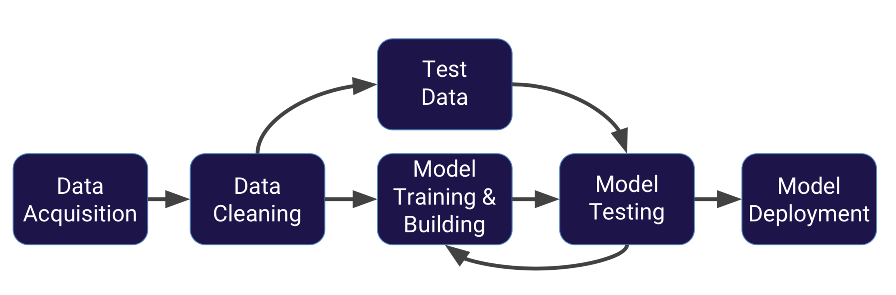

# DataScience_MachineLearning_Portfolio
 This Portfolio contains different Data Science and Machine Learning Projects.

## Machine Learning Process
This section documents the detial processes involved in machine learning and traing a machine learning model.

 - **[MACHINE_LEARNING_PROCESSES](./ml_fundamentals.md)**

  

## Machine Learning Package

**Scikit-Learn package** is the most popular machine learning package for python and has a lot of built-in algorithms.
- Every algorithm in scikit-learn is exposed via an estimator and you will need to install it using either:

- `pip install scikit-learn`
- or
- `conda install scikit-learn`

### Scikit-learn Estimator Object

- **Estimators*** allows you fit models and do the following:
 - model.fit():fit training data
 - For supervised learning applications, this accepts two argumnents: the data X and the labels y (e.g. model.fit(x,y)).
 - For unsupervised learning applications, this accepts only a single argument, the data x (e.g. model.fit(x)).
 - Because unsupervised learning works with unlabeled data.
**Available in Supervised estimators**
 - model.predict(): given a trained model, predict the label of a new set of data. This method accepts one argument, the new data x_new (e.g. model.predict(x_new)), and returns the learned label for each object in the array.
 - Also available in **supervised estimators**
 - model.predict_proba(): for classification problems, some estimators also provide this method, which returns the probability that a new observation has each categorical label. In this case, the label with the highest probability is returned by model.predict().
 - model.score(): for classification or regression problems, most estimators implements a score method. Scores are between 0 and 1, with a larger score indicating a better fit.
**Available in unsupervised estimators***
 - model.predict(): predict labels in clustering algorithms.
 - model.transform(): given an unsupervised model, transform new data into the new basis. This accepts one argument x_new, and rteurns the new representation of the data based on the unsupervised learning.
 - model.fit_transform(): some estimators implement this method, which more efficiently performs a fit and a transform the same input data.
 
## Linear Regression

### Result Examples

- linear regression model 

- predicted model using linear regression trained model
 

- Normally Distributed Predicted Model Results
 

# Cross Validation and Bias Variance Trade-Off
- Bias Variance is a fundamnetal topic for understanding model performance. For a more indepth understanding, you can review **chapter 2** of **[Introduction to Statistical Learning](https://blog.princehonest.com/stat-learning/)** by Gareth James, et al. For a brief discussion see:

- **[BAIS-VARIANCE_TRADE-OFF](./Bias-Variance_Trade-Off.md)**

## Logistic Regression

Logistic Regression allows us to solve classification problems, where we try to predict discrete categories.

- For more information on **Logistic Regression** read section 4-4.3 of **[Introduction to Statistical Learning](https://blog.princehonest.com/stat-learning/)** by Gareth James, et al.

- We cannot uses a normal regression model on binary groups. It won't give a good fit. So instead, we will transform our linear regression model to logistic regression curves.

## Example of Linear Regression Curve

- Transform the linear regression curve to logistic regression curve

## Example of Logistic Regression Curve

## Transformation of Linear Regression to Logistic Regression Curve

# Logist Regression Mathematical Calculation
- The Sigmoid (aka Logistic) Function takes in any value and outputs it to between 0 and 1.

## Evaluating Logistic Regression Model

 After training a logistic regression model, we can evaluate the performance of our model using:

 - **Confusion Matrix**
 - **Rate Accuracy**: This is how often is the correct prediction and can be calculated by: (TP + FN)/Total
 - **Miclassification Rate**: This is the overall error rate which is calculated by: (FP + FN)/Total

## More Information 
 - **[MACHINE_LEARNING_PROCESSES](./ml_fundamentals.md)**

