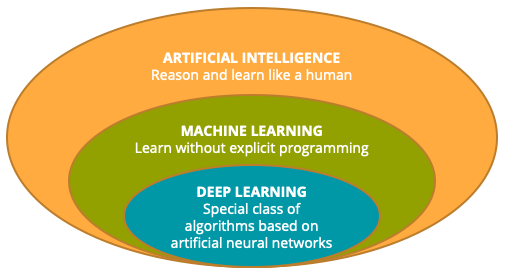

# Machine Learning Process 
This project documents the different processes involved in machine learning and cover both supervised and unsupervised machine learning. 

Machine learning is applicable to many different discipline such as language transalation as in Natural language Processing (NLP), Computer Vision for self-driving cars, Decision Making, and Analytics.

- **Evolution of Machine Learning**

- **Applications of Machine Learning**

 

## Machine Learning Proceedure

 

- **Supervised learning**

Machine learning algorithms are trained using labeled datasets, such as input where the desired output is already known. Examples:

- spam vs legitimate emails
- positive vs negative movie reviews

### Applications of supervised learning
Supervised learning is useful for future predictions where historical data can be used to predict future events. Examples of such include:

- fraud detection 
- recommendation engines
- web search 
- real-time ads on web pages
- credit scoring and next-best offers
- prediction of equipment failures
- new pricing models
- network intrusion detection
- customer segmentation
- prediction of customer churn
- pattern and image recognition etc.

## Important questions to remember when training a model
- is it fair to use a single data split to evaluate the model performance
- When after all, there will be chance to update the model parameters again and again.

## Data Split

It is important to split the Dataset into 3 parts:
- training dataset (use for training the model)
- validation dataset (use to determine which model hyperparameters to adjust)
- test dataset (use for evaluating the model performance metrics)

# Evaluating Model Performance for Classification Problems

In machine learning, we use metrics to evaluate perfomance of trained models especially for classification algorithms.The three most commonly used metrices are:
- Accuracy: this is the number of correct predictions made by the model divided by the total number of predictions. Useful where target classes are well balanced.
- Recall: this is the number of true positive divided by the number of true positive plus the number of false negative 
- Precision: is the number of true positives divided by the number of true positives plus the number of false positives 
- F1-Score: this actually is the combination of both `recall and precision`. So F1-Score is the harmonic mean of `precision` and `recall`

$$ F_1 = 2* (precision * recall / precision + recall)  $$

**The key realisation we need to make, is that in the real world, not all incorrect or correct matches hold equal value!**

- In the real world a single metric won't tell the complete story!
- So we can make use of the confusion matrix

## Confusion Matrix

 

**Note: our goal is to try to minimise the False Negatives** 

# Evaluating Model Performance for Regression problems

Regression is applied when a model attempts to predict continous values (unlike categorical values as in classification problems).

**For Example** 
- Attempting to predict the price of a house given it's features is a regression problem while
- Attempting to predict the price of a house based on the country it is located would be a classification problem.

## Common Evaluation Metrics for Regression Problems

- **MEAN ABSOLUTE ERROR (MAE)**

- **MEAN SQUARE ERROR (MSE)**

- **ROOT MEAN SQUARE ERROR (RMSE)**

 

**Important Notes**
- MAE won't punish large errors but we want to make sure that we are aware of this and account for the outliers.
- MSE accounts for large but sometimes difficult to interpret
- RMSE is the most popularly used metrics 

### Linear Regression 

- All we are trying to do when we calculate our regression line is draw a line that's as close to every dot as possible. 
- For classic linear regression, or "Least Squares Method" you only measure the closeness in the "up and down" direction.

- The goal of linear regression is to minimize the vertical distance between all the data points and our line.

- To determine the best line, we are attempting to minimize the distance between all the points.

- Methods to minimize this, (sum of squared errors, sum of absolute errors etc), note that all these methods have a general goal of minimizing this distance.

#### For example, one of the most popular methods is the "least squares method"

- The least squares method is fitted by minimizing the **sum of squares of the residuals***
- The residuals for an observation is the difference between the observation (the y-value) and the fitted line.

## Logistic Regression

Logistic Regression allows us to solve classification problems, where we try to predict discrete categories.

- For more information on **Logistic Regression** read section 4-4.3 of **[Introduction to Statistical Learning](https://blog.princehonest.com/stat-learning/)** by Gareth James, et al.

# K Nearest Neighbors (KNN)

- Chapter 4 of **[Introduction to Statistical Learning](https://blog.princehonest.com/stat-learning/)** by Gareth James, et al. discuss in detail K_Nearest_Neighbors (KNN).

## Important Points About KNN
- It is very easy to train and can work with any number of classes. However it is also equally important to remember that **Choosen K** will affect which new point that can be assigned. 
- It have a high prediction cost(meaning that it performs worse for large dataset)
- Not a good choice for highly deimensional dataset
- And it doesn't work well with categrorical dataset

### KNN Training Algorithm 
- First store all the Data

### KNN Prediction Algorithm
- Calculate the distance from X to all points in your data 
- Sort the points in your data by increasing distance from X
- predict the majority label of the "k" closest points

